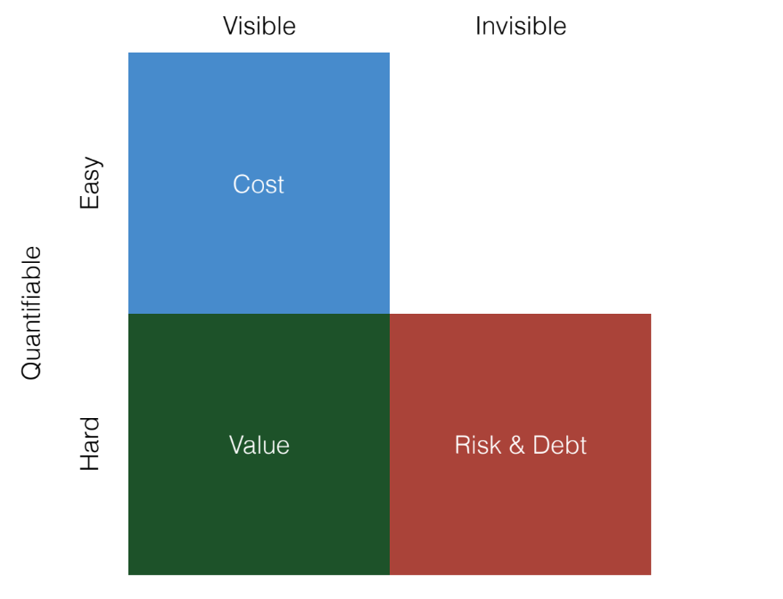
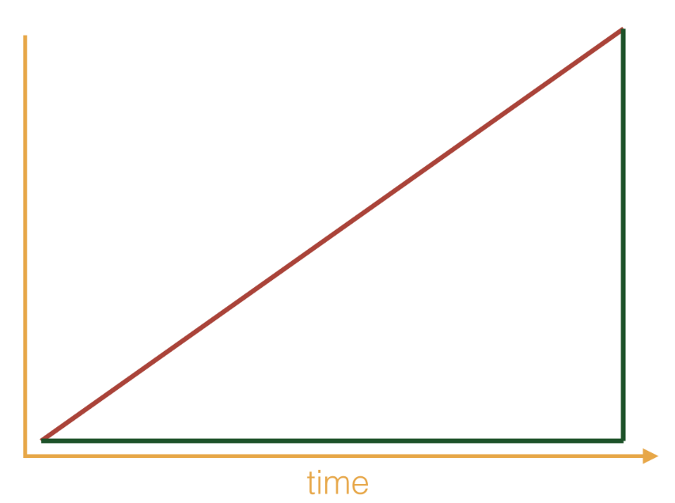
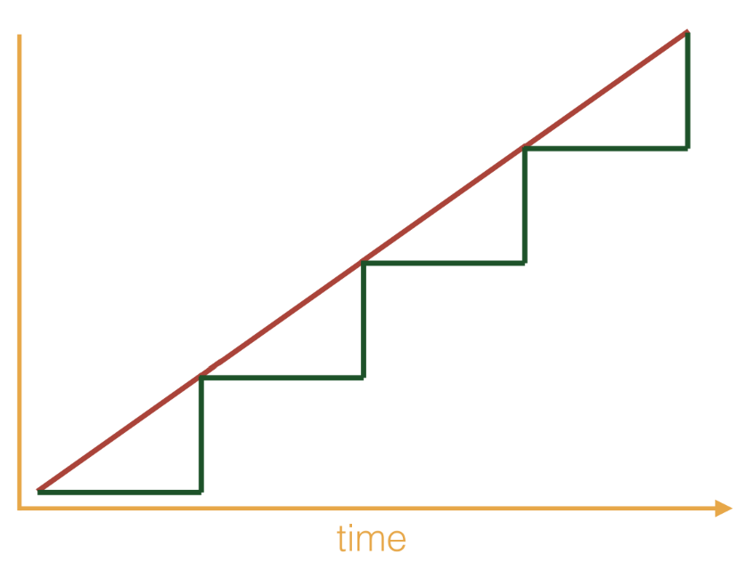
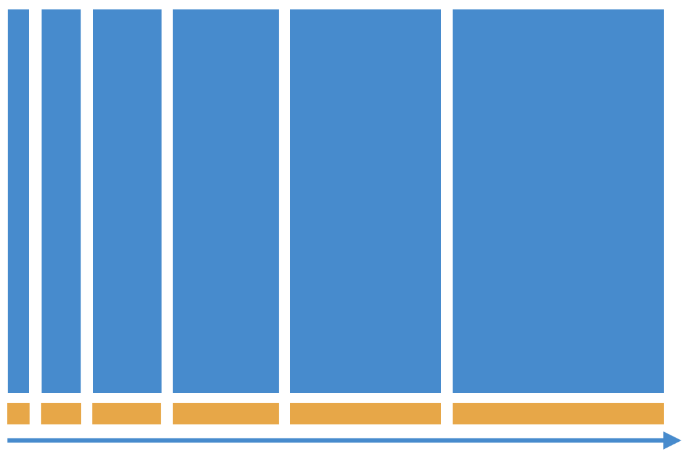
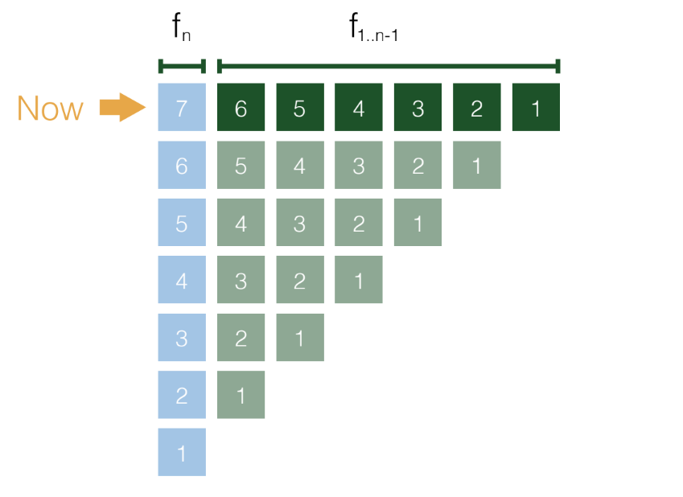
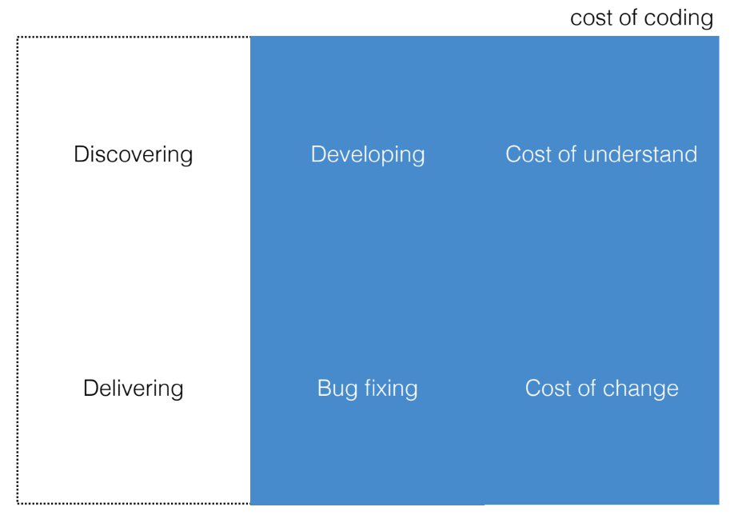
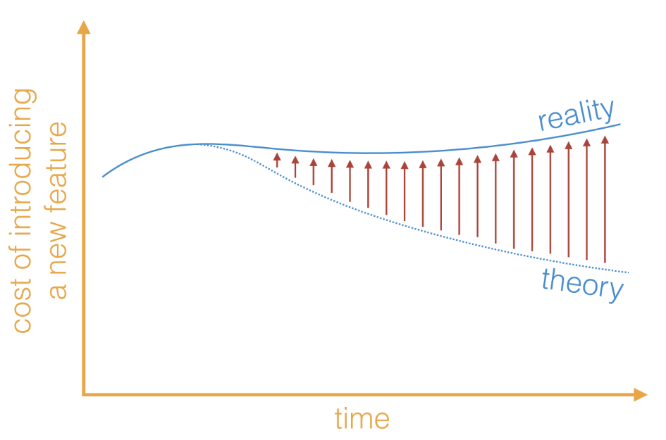

# Software economics

The good stuff is here:

## Discover vs. deliver

| Discover | Deliver |
| -------- | ------- |
| pair/mob programming | remote work |
| ideas | features |
| divergent | convergent |
| iterate questions | iterate answers |
| options | actions |
| spike/prototype/rewrite | refactor/maintain |
| manual | automated |
| explore | bottlenecks |
| unknown unknowns | already done in production |
| less done, less waste | mode done, more value |
| bugs not important | bugs are critical |

## What does Business need?

|     |     |
| --- | --- |
| Early delivery of **value**, | ROI / Time to market Risk reduction Hypothesis validation Stakeholders shared vision |
| with the lowest possible **cost**, |  |
| keeping options open, | So that **risk** is reduced To face uncertainty with better odds |
| with **debt** under control | To avoid being unable to pay it off in the future |

- Speak the same language: economics
- Share a common goal
- Give options to change, abandon, postpone or grow

## Why so much effort on keeping cost under control?

- Cost is not always the most important thing

## Waterfall vs iterative-incremental development

## Challenges - Code economics

- Vertical slicing

The cost of software is the cost of evolving software

## Challenges - Testing

- Automatization

## Design as an economic team activity

Some examples: 

|     |     |     |
| --- | --- | --- |
| Risk driven | - Architecture - Knowledge sharing | Do we need a cache to face new users? Only Jow knows about this. What if he leaves? |
| Debt driven | - Refactoring | We got to the demo, but this crap won't be easy to grow |
| Cost driven | - **Software Design** - Delivery automation | We only need to add the aggregate total on screen, but changing that will require changing half the app |
| Value driven | - Discovering big impact features | This feature is what's going to get us ahead |

- Software design mainly lets us manage the **cost**

- Tightly related to coupling and cohesion! 

## Summary

- If you care about Business goals, you'll have to speak the same language and share the same goals: more value and less cost, debt and risk
- The only way to manage risk is by developing in an iterative-incremental fashion
- That will force you to change often your code base
- A bad design will make those changes expensive
- A good design supports change
 

